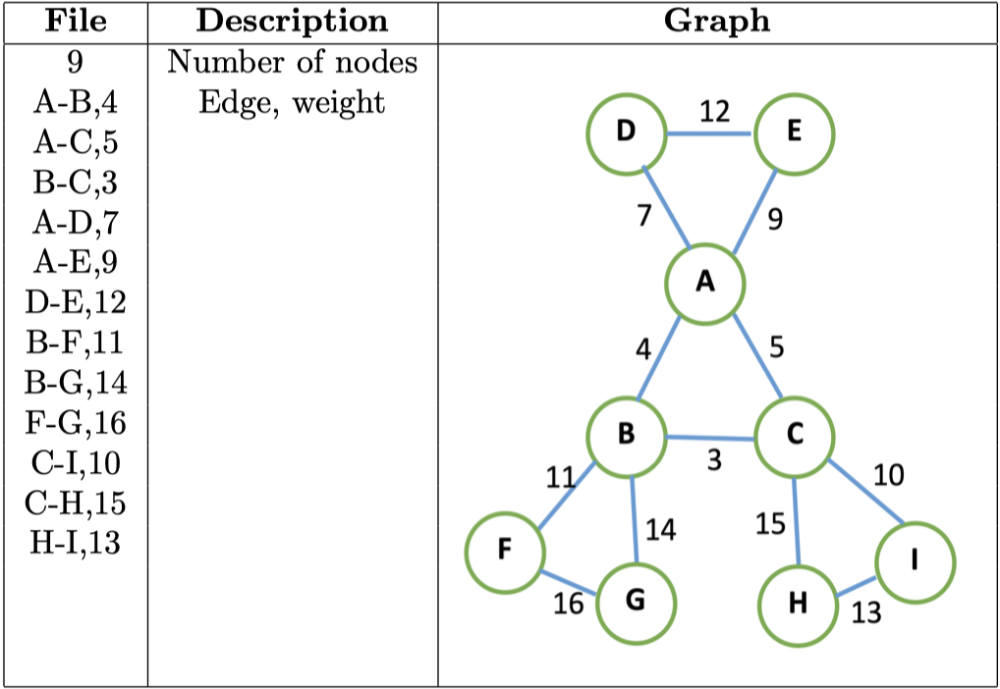
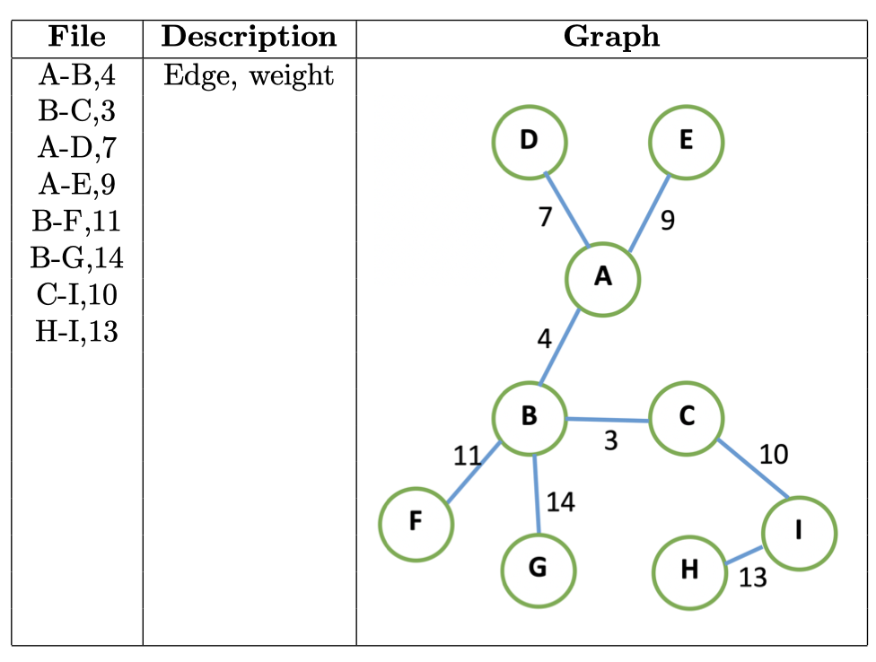

# GHS algorithm

The GHS algorithm of Gallager, Humblet and Spira is one of the best-known algorithms in distributed computing theory. This algorithm can construct the distributed minimum spanning tree in asynchronous Message-passing model.

In this project, I implement the GHS algorithm using Kompics library in Java. 

The program read a graph file which looks like this:

And then calculate the MST and its output looks like this:

